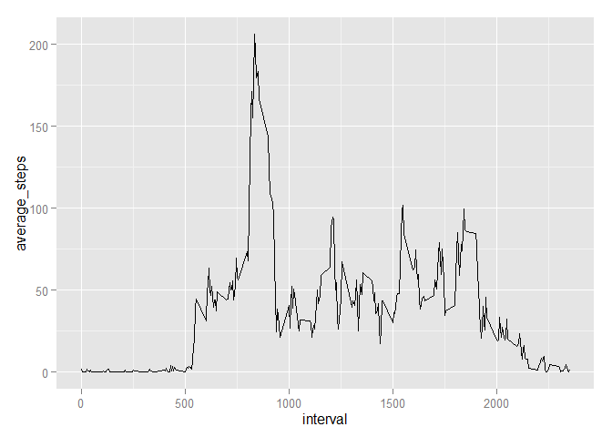
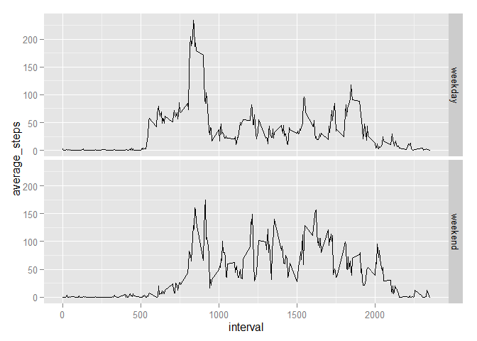

# Reproducible Research: Peer Assessment 1

## Read, explore and tidy up data.

```r
unzip('activity.zip')
amdata <- read.csv('activity.csv', header=TRUE, sep = ',')
str(amdata)
```

```
## 'data.frame':	17568 obs. of  3 variables:
##  $ steps   : int  NA NA NA NA NA NA NA NA NA NA ...
##  $ date    : Factor w/ 61 levels "2012-10-01","2012-10-02",..: 1 1 1 1 1 1 1 1 1 1 ...
##  $ interval: int  0 5 10 15 20 25 30 35 40 45 ...
```

```r
for(i in 1:length(amdata) ) {
  str(amdata[i])
  }
```

```
## 'data.frame':	17568 obs. of  1 variable:
##  $ steps: int  NA NA NA NA NA NA NA NA NA NA ...
## 'data.frame':	17568 obs. of  1 variable:
##  $ date: Factor w/ 61 levels "2012-10-01","2012-10-02",..: 1 1 1 1 1 1 1 1 1 1 ...
## 'data.frame':	17568 obs. of  1 variable:
##  $ interval: int  0 5 10 15 20 25 30 35 40 45 ...
```

Since date was read as Factor, explicit casting to date is needed.


```r
amdata$date <- as.Date( amdata$date, format = '%Y-%m-%d' )
str(amdata$date)
```

```
##  Date[1:17568], format: "2012-10-01" "2012-10-01" "2012-10-01" "2012-10-01" ...
```

## What is mean total number of steps taken per day?
load required libraries.


```r
library(plyr)
library(ggplot2)
```

Get the total steps by day and check the output.


```r
steps_by_day <- ddply(amdata, .(date),
                  summarize,
                  total_steps = sum(steps)
                  )
head(steps_by_day)
```

```
##         date total_steps
## 1 2012-10-01          NA
## 2 2012-10-02         126
## 3 2012-10-03       11352
## 4 2012-10-04       12116
## 5 2012-10-05       13294
## 6 2012-10-06       15420
```

Make the required histogram.


```r
steps_hist <- ggplot(steps_by_day,
                      aes(x = total_steps)
                      )
steps_hist <- steps_hist + geom_histogram()
print(steps_hist)
```

 

Calculate and show the required statistics.


```r
summary(steps_by_day$total_steps)
```

```
##    Min. 1st Qu.  Median    Mean 3rd Qu.    Max.    NA's 
##      41    8841   10760   10770   13290   21190       8
```

```r
summary(steps_by_day$total_steps)['Mean']
```

```
##  Mean 
## 10770
```

```r
summary(steps_by_day$total_steps)['Median']
```

```
## Median 
##  10760
```


## What is the average daily activity pattern?
Calculate the average steps per day and check output.

```r
steps_av <- ddply(amdata, .(interval),
                  summarize,
                  average_steps = mean(steps, na.rm=TRUE
                                       )
                  )
head(steps_av)
```

```
##   interval average_steps
## 1        0     1.7169811
## 2        5     0.3396226
## 3       10     0.1320755
## 4       15     0.1509434
## 5       20     0.0754717
## 6       25     2.0943396
```

Make the requested plot.


```r
steps_av_plot <- ggplot(steps_av,
                     aes(interval, average_steps)
                     )
steps_av_plot <- steps_av_plot + geom_line()
print(steps_av_plot)
```

 

Get the maximum.


```r
summary(steps_av$average_steps)
```

```
##    Min. 1st Qu.  Median    Mean 3rd Qu.    Max. 
##   0.000   2.486  34.110  37.380  52.830 206.200
```

```r
summary(steps_av$average_steps)['Max.']
```

```
##  Max. 
## 206.2
```


## Imputing missing values

Count the rows that have NAs and values.


```r
table( complete.cases(amdata) )
```

```
## 
## FALSE  TRUE 
##  2304 15264
```

Create a new dataset replacing NA values with the average for that interval.


```r
amdata_imputed <- amdata
amdata_imputed$steps <- ifelse( is.na(amdata_imputed$steps),
                     steps_av$average_steps[match(amdata_imputed$interval, steps_av$interval) ],
                     amdata_imputed$steps )
table( complete.cases(amdata) )
```

```
## 
## FALSE  TRUE 
##  2304 15264
```

```r
table( complete.cases(amdata_imputed) )
```

```
## 
##  TRUE 
## 17568
```

Get totals on new dataset

```r
total_amdata_imputed <- ddply(amdata_imputed, .(date),
                  summarize,
                  total_steps = sum(steps)
                  )
head(total_amdata_imputed)
```

```
##         date total_steps
## 1 2012-10-01    10766.19
## 2 2012-10-02      126.00
## 3 2012-10-03    11352.00
## 4 2012-10-04    12116.00
## 5 2012-10-05    13294.00
## 6 2012-10-06    15420.00
```

Plot the data with imputed missing values.


```r
total_amdata_imputed_plot <- ggplot(total_amdata_imputed,
                      aes(x = total_steps)
                      )
total_amdata_imputed_plot <- total_amdata_imputed_plot + geom_histogram()
print(total_amdata_imputed_plot)
```

 

Report the summary statistics.


```r
summary(total_amdata_imputed$total_steps)
```

```
##    Min. 1st Qu.  Median    Mean 3rd Qu.    Max. 
##      41    9819   10770   10770   12810   21190
```

```r
summary(total_amdata_imputed$total_steps)['Mean']
```

```
##  Mean 
## 10770
```

```r
summary(total_amdata_imputed$total_steps)['Median']
```

```
## Median 
##  10770
```

Mean and median are virtually the same before and after imputation. And graphically, the after imputation plot seems smoother and closer to a gaussian distribution, what seems to be the actual behavior of this data.

## Are there differences in activity patterns between weekdays and weekends?
Identify week days and weekend days


```r
amdata$day <- weekdays(amdata$date)

weekdays <- c('Monday', 'Tuesday', 'Wednesday', 'Thursday', 'Friday')
weekenddays <- c('Saturday', 'Sunday')

amdata$weekpart <- ifelse(amdata$day %in% weekdays, 'weekday', 'weekend')
head(amdata)
```

```
##   steps       date interval    day weekpart
## 1    NA 2012-10-01        0 Monday  weekday
## 2    NA 2012-10-01        5 Monday  weekday
## 3    NA 2012-10-01       10 Monday  weekday
## 4    NA 2012-10-01       15 Monday  weekday
## 5    NA 2012-10-01       20 Monday  weekday
## 6    NA 2012-10-01       25 Monday  weekday
```

```r
table(amdata$weekpart)
```

```
## 
## weekday weekend 
##   12960    4608
```


Do the required calculations for plotting.


```r
weekend_average <- ddply(amdata, .(interval, weekpart),
                  summarize,
                  average_steps = mean(steps, na.rm=TRUE
                                       )
                  )
head(weekend_average)
```

```
##   interval weekpart average_steps
## 1        0  weekday     2.3333333
## 2        0  weekend     0.0000000
## 3        5  weekday     0.4615385
## 4        5  weekend     0.0000000
## 5       10  weekday     0.1794872
## 6       10  weekend     0.0000000
```

Plot the data in a panel to compare weekdays and weekends


```r
weekend_plot <- ggplot(weekend_average,
                     aes(interval, average_steps)
                     )
weekend_plot <- weekend_plot + geom_line()
weekend_plot <- weekend_plot + facet_grid(weekpart ~ .)
print(weekend_plot)
```

 
